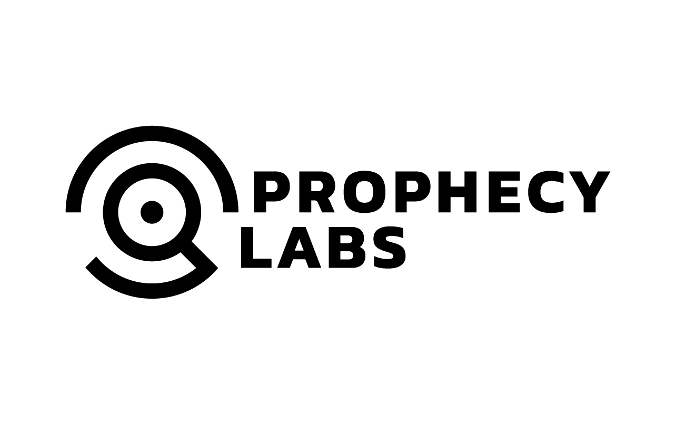
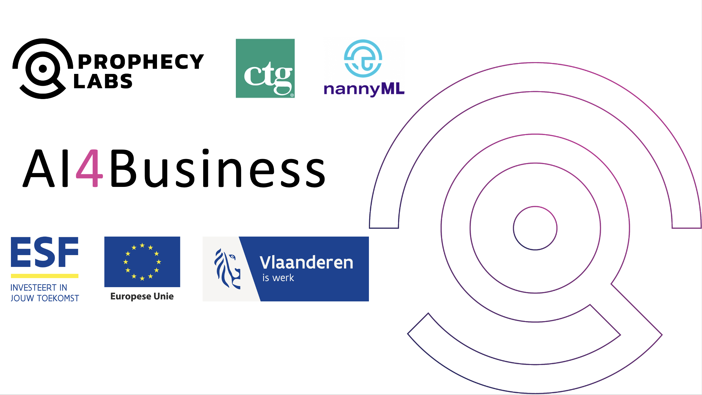

# AI4Business Course 
Welcome to the online repository for the **AI4Business** course!
The AI4Business course consists out of five modules:
1. Introduction to AI
2. Developing AI Tools
3. Capturing Value with AI
4. Deploying AI Solutions
5. MLOps & Monitoring

An online webpage for the course is available at the following web address: [AI4Business by Prophecy Labs](https://sites.google.com/prophecylabs.com/ai4business).

---

## Mission & Vision

Are you a business manager looking to deepen your AI knowledge and skills? Are you a data scientist interested in bringing business value with your AI solutions? Do you want to find out what it takes to bring AI to the real word in a production environment? Then this course is an ideal starting point for your journey. 

The material is organized in a modular format with five course modules in total. This allows you to either follow the full course or select the topics you find interesting. The course starts from the basics on AI and gradually evolves towards building real-life AI systems. Always keeping in mind that the most important element is to generate value with your solutions. We bridge the gap between business and technical people, allowing AI to thrive in your company.

We wish you an interesting and educational experience. Happy learning!

---

## Course Material

This AI4Business course takes you on a journey into the exciting realm of Artificial Intelligence or AI. The material puts focus on managers in search of business value with AI. Discover the various topics we have lined up for you, structured in five modules:
1. **Introduction to AI**: We start from the very basics to demistify  AI. Find out what AI actually means, what AI can and can't do and also when or how to use AI. After this module you will be more able to communicate with technical people in the AI lingo.
2. **Developing AI tools**: Discover the AI team and project steps and see how to evaluate your project after completion A hands-on tutorial brings all the theoretical concepts to practice. After this module you will have a better view of an AI project workflow.
3. **Capturing value with AI**:
4. **Deploying AI solutions**: Find out what it takes to bring AI to the real world and which challenges are blocking the way from PoC to an actual production environment. We show the importance of good data. After this module you will have a complete view of AI in real life.
5. **MLOps & Monitoring**: Learn best practices for AI model deployment and maintenance with MLOps and CRISP - ML(Q). We also highlight the importance of good monitoring. After this module you will be able to keep capturing value with AI during its whole lifetime.

An overview of the course is presented in the video *Course_Overview.mp4* (see the information below to download).

### Download

To download all the course material please click on `Code > Download ZIP` at the top of this repository.
This will download the material for all modules in the structure listed below.

### Folder Structure

Each of the module folders for *Module x* is structured as follows:
- Module_x_notes.pdf: lecture notes for the module (PDF)
- Module_x_slides.pdf: complete slide deck for the module (PDF)
- Module_x_slides.ppt: complete slide deck for the module (PPT)
- x_0 Overview
  - Overview.mp4: video recording with a module overview (MP4)
  - Overview.pdf: presentation slides with a module overview (PDF)
- x_1 First Section
  - FirstSection.mp4: video recording of the first section (MP4)
  - FirstSection.pdf: presentation slides of the first section (PDF)
- x_2 Second Section
  - SecondSection.mp4: video recording of the second section (MP4)
  - SecondSection.pdf: presentation slides of the second section (PDF)
- ...

The subfolder *2_6 Hands-on Tutorial* under *Module 2 - Developing AI tools* contains two practical applications of AI use cases. These are available as Jupyter Notebooks (IPYNB), but also as rendered webformat (HTML) and rendered textdocument (PDF).
- Supervised classification with Titanic data
- Supervised regression with Boston housing data

The folder *Team assignments* contains the following PDF items:
- Ready for AI: assess how ready your company is to pursue an AI journey
- AI Use Cases: assist you in finding, scoring, picking and executing AI use cases
- Bias in AI: start a panel discussion on the topic of bias in AI systems

---

## Business model

Prophecy Labs is an AI startup performing both consulting and end-to-end data science projects for clients. Our main goal and dream is to disseminate AI knowledge and make people aware of its potential. We strive to lift the AI possibilities to a higher level, thereby creating value for companies, employees, customers and society.

We developed this open source AI4Business course, such that everyone has access to learn from our experiences. Our aspirations are to bring true added value to companies and train the next generation of AI professionals. In no way, shape or form is this course meant to be a profitable concept. The course stays open source, freely to consult by everyone. We also aim to bring this knowledge directly to the people by giving trainings and sharing new content via social media outlets.

The world of AI is fast-paced and ever changing, so any AI course is by definition never truly finished. We therefore aim to continuously update this course with new  and exciting AI developments that can help businesses to thrive. Your opinions are of course very valuable to us in order to keep improving and updating the course, so feel free to fill in our [feedback survey](https://forms.gle/LgEuxzUJEt762sNT8). We also very much welcome content contributions and partnerships, see below for more details on this.

---

## Contribute
We very much welcome content contributions and partnerships for the further development of the AI4Business course. Interested? Please feel free to send us a pull request to do so.

